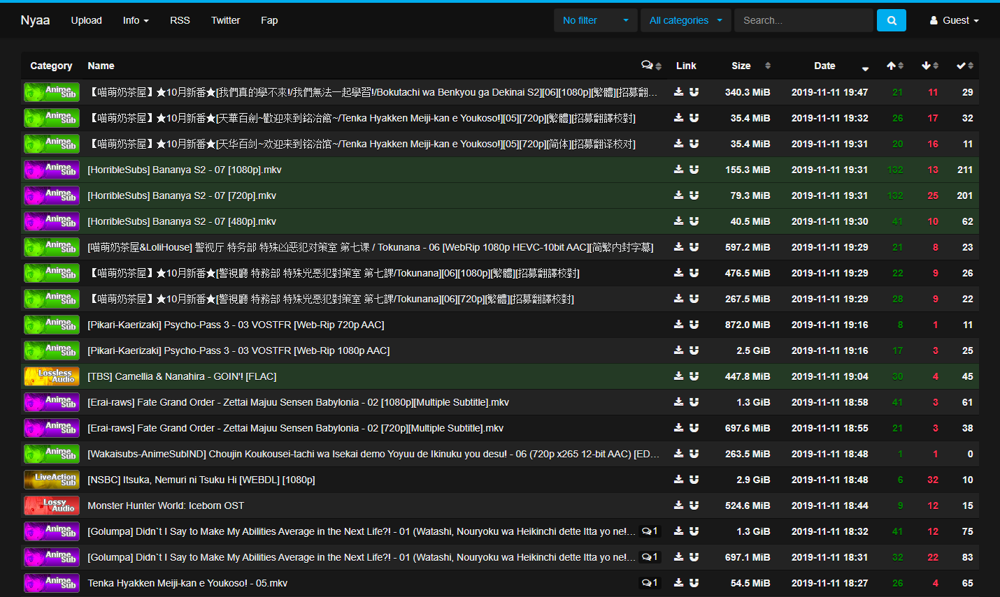

# Nyaa DeeperDark
 Combination of "DeepDark" by [RaitaroH](https://github.com/RaitaroH) and "Nyaa.si Dark" by [Coordinates](https://userstyles.org/users/195342)
 
 ## Installing

#### Using a browser extension:
* Stylus - get the addon for [Firefox](https://addons.mozilla.org/en-US/firefox/addon/styl-us/), [Chrome](https://chrome.google.com/webstore/detail/stylus/clngdbkpkpeebahjckkjfobafhncgmne) and [Opera](https://addons.opera.com/en-gb/extensions/details/stylus/).
* This is only available using Stylus (see the [documentation](https://github.com/openstyles/stylus/wiki/Usercss)).
* Also see the documentation for information about customizing the theme. :tada:

### Install this theme:

## Themes

- Deep-Dark
- Inspired-Dark
- Breeze-Dark
- HavocOS
- Arc-Dark
- Adapta-Nokto
- Adapta-Breath-Nokto
- Gruvbox-Dark
- Gruvbox-Light
- NierAutomata-Dark
- NierAutomata-Light
- Solarized-Dark
- Solarized-Light
- Vertex-Dark
- Mint-Y-Dark
- 9anime
- Firefox-Dark
- Firefox-57
- Discord
- YouTube-Dark
- Black-and-White
- Yellow
- Yellow-2
- Ubuntu-Grey
- Ubuntu-Purple
- Orange
- Jisho

# Screenshots

